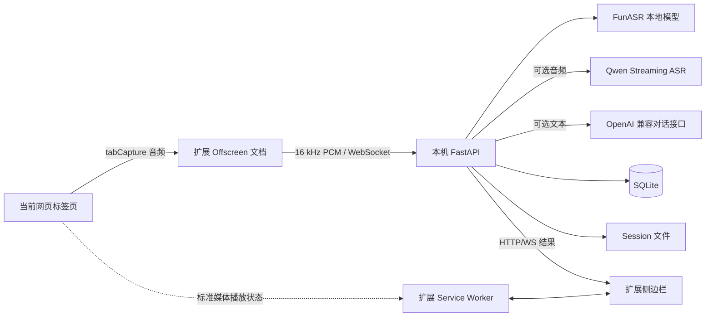

# 架构与数据流

Study Companion 是“浏览器扩展 + 本机服务”的单机架构。扩展获取浏览器授权和展示 UI，本机服务
持有密钥、运行模型并保存数据。

## 组件图

## 状态归属

| 状态 | 权威来源 | 是否跨重启 |
| --- | --- | --- |
| 逐字稿、问答、Session 元数据 | 本机 `data/` | 是 |
| 云端 ASR/LLM 配置与 Key | 本机配置 JSON 或 `.env` | 是 |
| 当前 Session 选择、UI 偏好 | 扩展 `chrome.storage` | 通常是 |
| 当前标签页授权 | 扩展 session storage / Chrome | 否或受导航影响 |
| 是否正在捕获音频 | Chrome 实际捕获状态 + 扩展运行状态 | 否 |
| 后端当前活跃 Session 集合 | FastAPI 进程内存 | 否 |

因此，服务或侧边栏重启后可以恢复 Session 内容，但不应把旧的“正在采集”标志当成真实音频流。
扩展会与 Chrome 捕获列表重新核对。

## 转写数据流

1. 用户在当前标签页点击扩展图标，Chrome 授予临时 `activeTab`/`tabCapture` 能力。
2. 用户在侧边栏手动开始；新采集创建 Session，历史采集复用原 Session。
3. offscreen 文档获取标签页 MediaStream，把声音继续输出给用户，并生成单声道 PCM。
4. PCM 发送给本机 WebSocket。
5. Provider 产生临时稿或最终稿。
6. 最终稿先写 SQLite 和 `transcript.raw.jsonl`，再回传 UI。
7. 停止时生成 `transcript.final.md` 和 `conversation.json` 等物化文件。

如果连接意外结束，WebSocket `finally` 路径也会尝试结束 Session 并写物化文件。即使进程被强制
终止，已经确认的片段仍在 SQLite 和只追加 JSONL 中；最后一个尚未确认的临时稿可能丢失。

## 时间轴

- 对标准媒体元素，扩展在暂停、等待、结束时暂停发送音频，避免把用户暂停时间计入逐字稿。
- Provider 产生当前采集段内的相对时间。
- 继续历史 Session 时，后端以现有展示时间轴末尾作为 `capture_offset_ms`，新段向后追加。
- 对旧版本已经产生的明显时间回跳，读取和导出层构造连续展示时间轴，同时保留原始时间字段。
- 无法观测播放状态的 WebAudio、自绘播放器或跨域播放器会回退到音频流时钟。

## 问答数据流

每个 Session 的历史消息形成连续对话。用户每次提问都重新决定是否授权发送逐字稿。后端组装：

1. 系统约束；
2. 可选逐字稿上下文；
3. 当前 Session 历史消息；
4. 本次问题。

模型返回内容按原文保存，前端使用受控 Markdown 渲染。前端渲染器会转义原始 HTML，不把模型
输出直接注入页面。

## 信任边界

- 扩展到本机服务：仅允许扩展 origin 和 localhost/127.0.0.1 的 CORS 来源；WebSocket 本身
  没有用户鉴权，因此服务必须保持回环监听。
- 本机服务到云端：只有用户选择云端 ASR 或发送问答时才发送对应内容。
- 存储：Session 数据和 Key 都在用户指定的本机数据目录；项目不提供云同步。
- 网页：页面标题和 URL 可能来自不可信网页，只作为元数据或受限上下文，不应当作指令执行。
